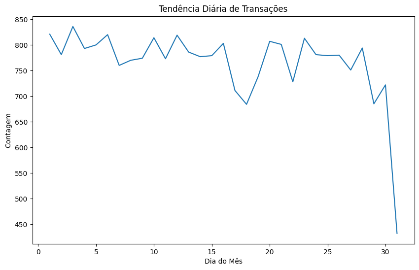
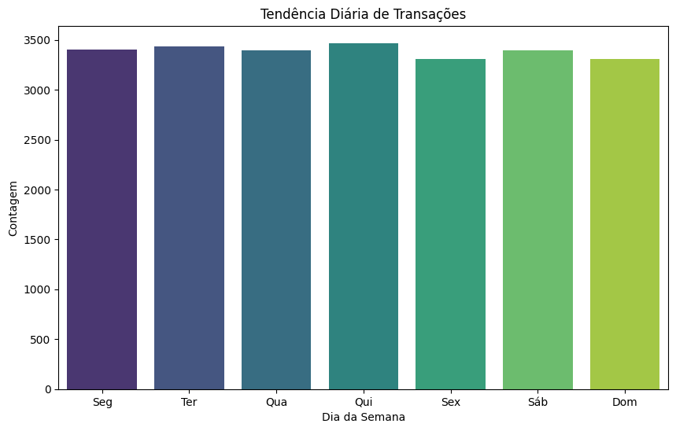

<p align="center">
   <a href='https://jonasaacampos.github.io/portfolio/'>
      
      </a>

</p>

<h1>Análise de Transações PIX</h1>


<h2>Análise de transações fraudulentas com base em uma amostra de dados históricos</h2>


> Através da base de transações do pix o banco deseja entender qual é o perfil dos clientes que utilizam o pix, além de verificar possíveis transações que tenham fraude. Porém, eles tem um cliente específico que tem um relacionamento muito bom para o banco, por isso, você recebeu a base de transações de cliente dos últimos 2 anos e precisa a partir dela criar um relatório contendo as principais características das transações. 

**In God we trust, all others must bring data.** (W. Edwards Deming)

-----------

[](https://jonasaacampos.github.io/portfolio/)
[](https://www.linkedin.com/in/jonasaacampos)


---------

### Objetivos

- Limpar e pré-processar os dados das transações PIX
- Analisar padrões de uso do PIX, tais como os canais mais utilizados e os valores de transação mais comuns
- Use o PySpark MLlib para treinar e avaliar um modelo de detecção de fraude
- Avaliar o desempenho do modelo e fazer recomendações para melhorias futuras

### Metodologia

Para esta análise usarei a metodologia CRISP-DM. Fiz algumas anotações sobre esta metodologia e compartilhei neste repositório https://github.com/jonasaacampos/CRISP-DM

Há um pdf com os principais passos que utilizo no CRSIP-DM que compartilhei no linkedin, e pode ser acessado [neste link](https://www.linkedin.com/posts/jonasaacampos_crisp-dm-guia-para-consulta-r%C3%A1pida-activity-7186406004991877120-4Uun?utm_source=share&utm_medium=member_desktop)


### Dados

O conjunto de dados inclui as seguintes informações para cada transação:
- Detalhes da transação: valor, tempo, remetente e receptor CPF/CNPJ, tipo
- Etiqueta de fraude: uma variável binária que indica se a transação foi fraudulenta (1) ou não (0)

<details>
<summary>Detalhes do arquivo json (estrutura dos dados)</summary>

#### amostra do arquivo

```json
 {
        "id_transacao": 100998,
        "valor": 4339.33,
        "remetente": {
            "nome": "Jonathan Gonsalves",
            "banco": "BTG",
            "tipo": "PF"
        },
        "destinatario": {
            "nome": "Alana Castro",
            "banco": "Caixa",
            "tipo": "PJ"
        },
        "chave_pix": "cpf",
        "categoria": "transferencia",
        "transaction_date": "2022-09-25 09:50:35",
        "fraude": 0
    }

```

```json
{
  "id_transacao": inteiro,
  "valor": texto,
  "remetente": {
      "nome": texto,
      "banco": texto,
      "tipo": texto
  }, 
  "destinatario": {
      "nome": texto, 
      "banco":texto,
      "tipo": texto
  },        
  "categoria": texto,
  "transaction_date":texto,
  "chave_pix":texto,
  "fraude":inteiro,
}
```

</details>

### Tarefas ✅

- [x] Normalização dos dados
  - [x] O dataset será em  `*.json`. Analisar a estrutura do arquivo
  - [x] Faça sua transformação para formato colunar
- [x] Análise Exploratória de Dados: Use o PySpark para analisar padrões de uso do PIX
  - [x] chaves pix mais usadas;
  - [x] os valores de transação mais comuns;
  - [x] distribuição dos valores de transação
    - [x] hora
    - [x] dia
  - [x] quais bancos receberam mais transferências por dia;
  - [x] para qual tipo de pessoa (PF ou PJ) foram realizadas mais transações
- [x] Engenharia de Recursos: 
  - [x] Apresentar novas características que podem ser úteis para a detecção de fraudes, tais como o número de transações feitas pelo mesmo remetente em um período de tempo específico.
- [x] Modelagem: Use o PySpark MLlib para treinar e detectar possíveis transações que contenham fraude.

------------------


------------

**Table of contents**<a id='toc0_'></a>    
- [1 - Preparação do Ambiente de Desenvolvimento](#1---preparação-do-ambiente-de-desenvolvimento)
  - [Preparação do ambiente](#preparação-do-ambiente)
    - [IDEs utilizada](#ides-utilizada)
    - [Criar ambiente virtual](#criar-ambiente-virtual)
    - [Ativar .venv](#ativar-venv)
- [2 - Data Undesrtanting](#2---data-undesrtanting)
  - [Data Schema](#data-schema)
- [3 - Preparação dos Dados](#3---preparação-dos-dados)
  - [Instalando bibliotecas e componentes necessários](#instalando-bibliotecas-e-componentes-necessários)
  - [Funções personalizadas para apoio](#funções-personalizadas-para-apoio)
  - [Data Schema](#data-schema-1)
  - [Ajustando a visualização dos dados](#ajustando-a-visualização-dos-dados)
  - [Sumarização dos dados](#sumarização-dos-dados)
- [4 - Análise exploratória](#4---análise-exploratória)
  - [Insights e Análises iniciais](#insights-e-análises-iniciais)
- [5 - Modelagem](#5---modelagem)
- [6 - Modelo de Predição de Fraudes](#6---modelo-de-predição-de-fraudes)
- [Discalimer](#discalimer)
- [Cont(r)ate-me 📫:](#contrate-me-)

<!-- vscode-jupyter-toc-config
	numbering=false
	anchor=true
	flat=false
	minLevel=1
	maxLevel=6
	/vscode-jupyter-toc-config -->
<!-- THIS CELL WILL BE REPLACED ON TOC UPDATE. DO NOT WRITE YOUR TEXT IN THIS CELL -->


## <a id='toc1_1_'></a>[1 - Preparação do Ambiente de Desenvolvimento](#toc0_)

<details>
<summary>Preparação do ambiente</summary>

### <a id='toc1_1_1_'></a>[Preparação do ambiente](#toc0_)

#### <a id='toc1_1_1_1_'></a>[IDEs utilizada](#toc0_)

 - VSCode

#### <a id='toc1_1_1_2_'></a>[Criar ambiente virtual](#toc0_)

- Command Pallet (ctrl + shift+ p)
- Python: Create Environment > Venv > Python Version (3.12)'

#### <a id='toc1_1_1_3_'></a>[Ativar .venv](#toc0_)

In VsCode terminal, alterar a política de execução de scripts para ativar o ambiente virtual.

```bash
Set-ExecutionPolicy Unrestricted -Scope Process

# ativar ambiente virtual
.\.venv\Scripts\activate

```

</details>

## <a id='toc1_2_'></a>[2 - Data Undesrtanting](#toc0_)

Primeiramente, devemos entender tudo sobre a fonte dos dados
- Como o dado chega até nós?
- Qual formato virá? 
- Aonde o processamento será executado (AWS EMR, Cluster On-Premise)? 
- De quanto em quanto tempo eu preciso gerar esse relatório (mensal, diário, near-real time)?


Os dados foram compartilhados via `*.json`. Saber como os dados serão ingeridos são de vital importância para delimitar a forma como lidaremos com nosso projeto. Análises em tempo real (streaming) são diferentes de análises em lotes (bacthes). Análises pontuais como esta também adotam uma estratégia diferentes das que requerem análises periódicas.

### <a id='toc1_2_1_'></a>[Data Schema](#toc0_)

```json
{
  "id_transacao": inteiro,
  "valor": texto,
  "remetente": {
      "nome": texto,
      "banco": texto,
      "tipo": texto
  }, 
  "destinatario": {
      "nome": texto, 
      "banco":texto,
      "tipo": texto
  },        
  "categoria": texto,
  "transaction_date":texto,
  "chave_pix":texto,
  "fraude":inteiro,
}
```

## <a id='toc1_3_'></a>[3 - Preparação dos Dados](#toc0_)

Agora é hora de começar a preparar os dados de acordo com as necessidades do escopo de trabalho.

### <a id='toc1_3_1_'></a>[Instalando bibliotecas e componentes necessários](#toc0_)


```python
#%pip install pyspark
#%pip freeze > requirements.txt
```


```python
import os
import matplotlib.pyplot as plt
import seaborn as sns
import pandas as pd

from pyspark.sql import SparkSession
from pyspark.sql.functions import (
    col,
    date_format,
    length,
    max,
    min,
    avg,
    format_number,
    count,
    lit,
    floor,
    udf,
    round,
    when,
    year,
    month,
    dayofmonth,
    dayofweek,
)
from pyspark.sql.types import (
    StructType,
    StructField,
    StringType,
    IntegerType,
    DoubleType,
)

from pyspark.ml import Pipeline
from pyspark.ml.feature import StringIndexer, VectorAssembler
from pyspark.ml.classification import LogisticRegression
```

### <a id='toc1_3_2_'></a>[Funções personalizadas para apoio](#toc0_)


```python
# função para inicializar o spark
def spark_initialize_session(app_name = 'My Analysis'):
    from pyspark.sql import SparkSession
    spark = (
        SparkSession.builder
        .config('spark.ui.port', '4050')
        .appName(app_name)
        .getOrCreate()
    )

    return spark


# função para retornar a quantidade de linhas e colunas de um dataframe spark
def spark_show_info_df(df):
    df_lines = df.count()
    df_columns = len(df.columns)
    print(f'Dados do dataframe atual\nLinhas: {df_lines:,} | Colunas: {df_columns}')
```


```python
df_path = f'data{os.sep}raw{os.sep}case_final.json'
spark = spark_initialize_session()
```

    24/06/07 17:14:07 WARN Utils: Your hostname, codespaces-53b959 resolves to a loopback address: 127.0.0.1; using 172.16.5.4 instead (on interface eth0)
    24/06/07 17:14:07 WARN Utils: Set SPARK_LOCAL_IP if you need to bind to another address
    Setting default log level to "WARN".
    To adjust logging level use sc.setLogLevel(newLevel). For SparkR, use setLogLevel(newLevel).
    24/06/07 17:14:08 WARN NativeCodeLoader: Unable to load native-hadoop library for your platform... using builtin-java classes where applicable


**não usar o json formatado, isso causa lentidão e erros no algoritmo**

<details>
<summary>json schema anotations</summary>

### <a id='toc1_3_3_'></a>[Data Schema](#toc0_)

```json
{
  "id_transacao": inteiro,
  "valor": texto,
  "remetente": {
      "nome": texto,
      "banco": texto,
      "tipo": texto
  }, 
  "destinatario": {
      "nome": texto, 
      "banco":texto,
      "tipo": texto
  },        
  "categoria": texto,
  "transaction_date":texto,
  "chave_pix":texto,
  "fraude":inteiro,
}
```

</details>


```python
# definição do data schema
# amostra dos dados
# { "id_transacao": 100999, "valor": 7058.09, "remetente": { "nome": "Jonathan Gonsalves", "banco": "BTG", "tipo": "PF" }, "destinatario": { "nome": "Lais Nascimento", "banco": "Nubank", "tipo": "PF" }, "chave_pix": "aleatoria", "categoria": "vestuario", "transaction_date": "2022-02-25 09:31:47", "fraude": 0 }

data_schema_pix_remetente_destinatario = StructType([
    StructField('nome', StringType()),
    StructField('banco', StringType()),
    StructField('tipo', StringType())
    ])

data_schema_pix = StructType([
    StructField('id_transacao', IntegerType()),
    StructField('valor', DoubleType()),
    StructField('remetente', data_schema_pix_remetente_destinatario),   
    StructField('destinatario', data_schema_pix_remetente_destinatario),
    StructField('categoria', StringType()),
    StructField('transaction_date', StringType()),
    StructField('chave_pix', StringType(), True),
    StructField('fraude', IntegerType(), True),
    ])
```


```python
df_path = f'data{os.sep}raw{os.sep}case_final.json'
spark = spark_initialize_session()
```


```python
# "transaction_date": "2022-02-25 09:31:47"
df = spark.read.json(df_path, 
                     schema=data_schema_pix, 
                     timestampFormat='yyyy-MM-dd HH:mm:ss')
```


```python
# verificar tipo dos dados
df.printSchema()
```

    root
     |-- id_transacao: integer (nullable = true)
     |-- valor: double (nullable = true)
     |-- remetente: struct (nullable = true)
     |    |-- nome: string (nullable = true)
     |    |-- banco: string (nullable = true)
     |    |-- tipo: string (nullable = true)
     |-- destinatario: struct (nullable = true)
     |    |-- nome: string (nullable = true)
     |    |-- banco: string (nullable = true)
     |    |-- tipo: string (nullable = true)
     |-- categoria: string (nullable = true)
     |-- transaction_date: string (nullable = true)
     |-- chave_pix: string (nullable = true)
     |-- fraude: integer (nullable = true)
    


```python
# visualiar os dados no dataframe
df.show(5)
```

                                                                                    

    +------------+------------------+--------------------+--------------------+-------------+-------------------+---------+------+
    |id_transacao|             valor|           remetente|        destinatario|    categoria|   transaction_date|chave_pix|fraude|
    +------------+------------------+--------------------+--------------------+-------------+-------------------+---------+------+
    |        1000|            588.08|{Jonathan Gonsalv...|{Calebe Melo, Cai...|       outros|2021-07-16 05:00:55|aleatoria|     0|
    |        1001|           80682.5|{Jonathan Gonsalv...|{Davi Lucas Perei...|transferencia|2022-04-20 12:34:01|  celular|     1|
    |        1002|             549.9|{Jonathan Gonsalv...|{Sabrina Castro, ...|        lazer|2022-07-10 16:51:34|      cpf|     0|
    |        1003|             90.83|{Jonathan Gonsalv...|{Francisco da Con...|   transporte|2022-10-20 10:57:36|aleatoria|     0|
    |        1004|13272.619999999999|{Jonathan Gonsalv...|{Isabelly Ferreir...|transferencia|2021-04-06 20:26:51|    email|     0|
    +------------+------------------+--------------------+--------------------+-------------+-------------------+---------+------+
    only showing top 5 rows
    


*precisamos remover as estruturas aninhadas que estão nas colunas remetente e destinatário*

Para que cada coluna tenha apenas um tipo de dado, precisamos fazer o achatamento dos nossos dados.


```python
df_flatten = df.withColumns({
    'remetente_nome': col('remetente').getField('nome'),
    'remetente_banco': col('remetente').getField('banco'),
    'remetente_tipo': col('remetente').getField('tipo'),

    'destinatario_nome': col('destinatario').getField('nome'),
    'destinatario_banco': col('destinatario').getField('banco'),
    'destinatario_tipo': col('destinatario').getField('tipo'),
    }).drop('remetente', 'destinatario')
```


```python
print(df_flatten.printSchema())
```

    root
     |-- id_transacao: integer (nullable = true)
     |-- valor: double (nullable = true)
     |-- categoria: string (nullable = true)
     |-- transaction_date: string (nullable = true)
     |-- chave_pix: string (nullable = true)
     |-- fraude: integer (nullable = true)
     |-- remetente_nome: string (nullable = true)
     |-- remetente_banco: string (nullable = true)
     |-- remetente_tipo: string (nullable = true)
     |-- destinatario_nome: string (nullable = true)
     |-- destinatario_banco: string (nullable = true)
     |-- destinatario_tipo: string (nullable = true)
    
    None


```python
print(df_flatten.show(5))
```

    [Stage 1:>                                                          (0 + 1) / 1]

    +------------+------------------+-------------+-------------------+---------+------+------------------+---------------+--------------+--------------------+------------------+-----------------+
    |id_transacao|             valor|    categoria|   transaction_date|chave_pix|fraude|    remetente_nome|remetente_banco|remetente_tipo|   destinatario_nome|destinatario_banco|destinatario_tipo|
    +------------+------------------+-------------+-------------------+---------+------+------------------+---------------+--------------+--------------------+------------------+-----------------+
    |        1000|            588.08|       outros|2021-07-16 05:00:55|aleatoria|     0|Jonathan Gonsalves|            BTG|            PF|         Calebe Melo|             Caixa|               PF|
    |        1001|           80682.5|transferencia|2022-04-20 12:34:01|  celular|     1|Jonathan Gonsalves|            BTG|            PF|  Davi Lucas Pereira|             Caixa|               PJ|
    |        1002|             549.9|        lazer|2022-07-10 16:51:34|      cpf|     0|Jonathan Gonsalves|            BTG|            PF|      Sabrina Castro|            Nubank|               PF|
    |        1003|             90.83|   transporte|2022-10-20 10:57:36|aleatoria|     0|Jonathan Gonsalves|            BTG|            PF|Francisco da Conc...|            Nubank|               PJ|
    |        1004|13272.619999999999|transferencia|2021-04-06 20:26:51|    email|     0|Jonathan Gonsalves|            BTG|            PF|   Isabelly Ferreira|               BTG|               PJ|
    +------------+------------------+-------------+-------------------+---------+------+------------------+---------------+--------------+--------------------+------------------+-----------------+
    only showing top 5 rows
    
    None


                                                                                    

### <a id='toc1_3_4_'></a>[Ajustando a visualização dos dados](#toc0_)


```python
spark_show_info_df(df_flatten)
```

    [Stage 2:=============================>                             (1 + 1) / 2]

    Dados do dataframe atual
    Linhas: 100,000 | Colunas: 12


                                                                                    


```python
# mostra a quantidade máxima e mínima de caracteres de cada coluna
df_flatten.select([max(length(col(c))).alias(c + '_max_lenght') for c in df_flatten.columns]).show()
df_flatten.select([min(length(col(c))).alias(c + '_min_lenght') for c in df_flatten.columns]).show()
```

    24/06/07 17:14:23 WARN GarbageCollectionMetrics: To enable non-built-in garbage collector(s) List(G1 Concurrent GC), users should configure it(them) to spark.eventLog.gcMetrics.youngGenerationGarbageCollectors or spark.eventLog.gcMetrics.oldGenerationGarbageCollectors
                                                                                    

    +-----------------------+----------------+--------------------+---------------------------+--------------------+-----------------+-------------------------+--------------------------+-------------------------+----------------------------+-----------------------------+----------------------------+
    |id_transacao_max_lenght|valor_max_lenght|categoria_max_lenght|transaction_date_max_lenght|chave_pix_max_lenght|fraude_max_lenght|remetente_nome_max_lenght|remetente_banco_max_lenght|remetente_tipo_max_lenght|destinatario_nome_max_lenght|destinatario_banco_max_lenght|destinatario_tipo_max_lenght|
    +-----------------------+----------------+--------------------+---------------------------+--------------------+-----------------+-------------------------+--------------------------+-------------------------+----------------------------+-----------------------------+----------------------------+
    |                      6|              18|                  13|                         19|                   9|                1|                       18|                         3|                        2|                          33|                            8|                           2|
    +-----------------------+----------------+--------------------+---------------------------+--------------------+-----------------+-------------------------+--------------------------+-------------------------+----------------------------+-----------------------------+----------------------------+
    


    [Stage 8:=============================>                             (1 + 1) / 2]

    +-----------------------+----------------+--------------------+---------------------------+--------------------+-----------------+-------------------------+--------------------------+-------------------------+----------------------------+-----------------------------+----------------------------+
    |id_transacao_min_lenght|valor_min_lenght|categoria_min_lenght|transaction_date_min_lenght|chave_pix_min_lenght|fraude_min_lenght|remetente_nome_min_lenght|remetente_banco_min_lenght|remetente_tipo_min_lenght|destinatario_nome_min_lenght|destinatario_banco_min_lenght|destinatario_tipo_min_lenght|
    +-----------------------+----------------+--------------------+---------------------------+--------------------+-----------------+-------------------------+--------------------------+-------------------------+----------------------------+-----------------------------+----------------------------+
    |                      4|               3|                   5|                         19|                   3|                1|                       18|                         3|                        2|                           8|                            2|                           2|
    +-----------------------+----------------+--------------------+---------------------------+--------------------+-----------------+-------------------------+--------------------------+-------------------------+----------------------------+-----------------------------+----------------------------+
    


                                                                                    


```python
# ajuste para visualização de todas as colunas
# o padrão é 20, o maior valor possível é 100
# o valor 33 é o suficiente para visualizar todas as colunas com base no nosso dataframe.destinatario_nome_max_lenght
spark.conf.set('spark.sql.debug.maxToStringFields', 33)
```

### <a id='toc1_3_5_'></a>[Sumarização dos dados](#toc0_)


```python
df_flatten.describe().show()
```

    24/06/07 17:14:26 WARN SparkStringUtils: Truncated the string representation of a plan since it was too large. This behavior can be adjusted by setting 'spark.sql.debug.maxToStringFields'.
    [Stage 11:=============================>                            (1 + 1) / 2]

    +-------+-----------------+------------------+-----------+-------------------+---------+------------------+------------------+---------------+--------------+-----------------+------------------+-----------------+
    |summary|     id_transacao|             valor|  categoria|   transaction_date|chave_pix|            fraude|    remetente_nome|remetente_banco|remetente_tipo|destinatario_nome|destinatario_banco|destinatario_tipo|
    +-------+-----------------+------------------+-----------+-------------------+---------+------------------+------------------+---------------+--------------+-----------------+------------------+-----------------+
    |  count|           100000|            100000|     100000|             100000|   100000|            100000|            100000|         100000|        100000|           100000|            100000|           100000|
    |   mean|          50999.5|10303.358732200059|       NULL|               NULL|     NULL|           0.15367|              NULL|           NULL|          NULL|             NULL|              NULL|             NULL|
    | stddev|28867.65779668774| 20874.99768875586|       NULL|               NULL|     NULL|0.3606339302787737|              NULL|           NULL|          NULL|             NULL|              NULL|             NULL|
    |    min|             1000|               0.0|alimentacao|2021-01-14 15:37:45|aleatoria|                 0|Jonathan Gonsalves|            BTG|            PF|   Agatha Almeida|               BTG|               PF|
    |    max|           100999|          89996.33|  vestuario|2023-01-15 02:51:10|    email|                 1|Jonathan Gonsalves|            BTG|            PF|   Yuri das Neves|                XP|               PJ|
    +-------+-----------------+------------------+-----------+-------------------+---------+------------------+------------------+---------------+--------------+-----------------+------------------+-----------------+
    


                                                                                    

## <a id='toc1_4_'></a>[4 - Análise exploratória](#toc0_)

### <a id='toc1_4_1_'></a>[Insights e Análises iniciais](#toc0_)

**Distribuição de Valores**

- **Distribuição de Valores de Transação:** A média é R$ 10,303.36, com um desvio padrão de R$ 20,874.99, indicando uma grande variabilidade nos valores das transações.
- **Transações de Alto Valor:** Os valores podem chegar até R$ 89,996.33, indicando transações de alto valor que podem merecer uma investigação mais detalhada.


```python
df = df.withColumn("day_of_week", dayofmonth("transaction_date"))
daily_trend = df.groupBy("day_of_week").count().orderBy("day_of_week").toPandas()
plt.figure(figsize=(10, 6))
sns.lineplot(x='day_of_week', y='count', data=daily_trend)
plt.title('Tendência Diária de Transações')
plt.xlabel('Dia do Mês')
plt.ylabel('Contagem')
plt.show()

```


    

    


```python
df_flatten.describe().show()
```

    24/06/07 17:14:26 WARN SparkStringUtils: Truncated the string representation of a plan since it was too large. This behavior can be adjusted by setting 'spark.sql.debug.maxToStringFields'.
    [Stage 11:=============================>                            (1 + 1) / 2]

    +-------+-----------------+------------------+-----------+-------------------+---------+------------------+------------------+---------------+--------------+-----------------+------------------+-----------------+
    |summary|     id_transacao|             valor|  categoria|   transaction_date|chave_pix|            fraude|    remetente_nome|remetente_banco|remetente_tipo|destinatario_nome|destinatario_banco|destinatario_tipo|
    +-------+-----------------+------------------+-----------+-------------------+---------+------------------+------------------+---------------+--------------+-----------------+------------------+-----------------+
    |  count|           100000|            100000|     100000|             100000|   100000|            100000|            100000|         100000|        100000|           100000|            100000|           100000|
    |   mean|          50999.5|10303.358732200059|       NULL|               NULL|     NULL|           0.15367|              NULL|           NULL|          NULL|             NULL|              NULL|             NULL|
    | stddev|28867.65779668774| 20874.99768875586|       NULL|               NULL|     NULL|0.3606339302787737|              NULL|           NULL|          NULL|             NULL|              NULL|             NULL|
    |    min|             1000|               0.0|alimentacao|2021-01-14 15:37:45|aleatoria|                 0|Jonathan Gonsalves|            BTG|            PF|   Agatha Almeida|               BTG|               PF|
    |    max|           100999|          89996.33|  vestuario|2023-01-15 02:51:10|    email|                 1|Jonathan Gonsalves|            BTG|            PF|   Yuri das Neves|                XP|               PJ|
    +-------+-----------------+------------------+-----------+-------------------+---------+------------------+------------------+---------------+--------------+-----------------+------------------+-----------------+
    


                                                                                    


```python
# Converter data
df = df.withColumn("transaction_date", col("transaction_date").cast("timestamp"))

# Adicionar coluna do dia da semana
df = df.withColumn("day_of_week_num", dayofweek("transaction_date"))

# Mapear números para nomes dos dias da semana
df = df.withColumn("day_of_week", when(col("day_of_week_num") == 1, "Dom")
                                  .when(col("day_of_week_num") == 2, "Seg")
                                  .when(col("day_of_week_num") == 3, "Ter")
                                  .when(col("day_of_week_num") == 4, "Qua")
                                  .when(col("day_of_week_num") == 5, "Qui")
                                  .when(col("day_of_week_num") == 6, "Sex")
                                  .when(col("day_of_week_num") == 7, "Sáb"))

# Agrupar e contar por dia da semana
daily_trend = df.groupBy("day_of_week").count().orderBy("day_of_week").toPandas()

# Ordenar dias da semana corretamente
order = ["Seg", "Ter", "Qua", "Qui", "Sex", "Sáb", "Dom"]
daily_trend['day_of_week'] = pd.Categorical(daily_trend['day_of_week'], categories=order, ordered=True)
daily_trend = daily_trend.sort_values("day_of_week")

# Plotar
plt.figure(figsize=(10, 6))
sns.barplot(x='day_of_week', y='count', data=daily_trend, palette='viridis')
plt.title('Tendência Diária de Transações')
plt.xlabel('Dia da Semana')
plt.ylabel('Contagem')
plt.show()
```

    /tmp/ipykernel_13025/1537681441.py:26: FutureWarning: 
    
    Passing `palette` without assigning `hue` is deprecated and will be removed in v0.14.0. Assign the `x` variable to `hue` and set `legend=False` for the same effect.
    
      sns.barplot(x='day_of_week', y='count', data=daily_trend, palette='viridis')


    

    


## <a id='toc1_5_'></a>[5 - Modelagem](#toc0_)

- Para qual banco esse cliente mais transfere?
- Qual é a média de transferências por período que esse cliente faz?
- Baseando-se no valor das transferências, poderia dar um aumento de crédito?
- Para o que esse cliente mais usa as transferências?
- Executar um algoritmo de machine learning que identifique possíveis transações com fraude.


```python
# Para qual banco foram feitas mais transações?
df_flatten.groupBy('destinatario_banco').count().orderBy(col('count').desc()).show()

```

    +------------------+-----+
    |destinatario_banco|count|
    +------------------+-----+
    |                XP|14401|
    |               BTG|14390|
    |            Nubank|14297|
    |              Itau|14281|
    |             Caixa|14240|
    |                C6|14204|
    |          Bradesco|14187|
    +------------------+-----+
    


```python
# Quantas transações são realizadas por mês para cada banco?
df_flatten.groupBy(
    date_format('transaction_date', 'yyyy-MM').alias('ano_mes'), 'destinatario_banco'
    ).count().orderBy(col('ano_mes').desc()).show()
```

    [Stage 17:=============================>                            (1 + 1) / 2]

    +-------+------------------+-----+
    |ano_mes|destinatario_banco|count|
    +-------+------------------+-----+
    |2023-01|              Itau|  267|
    |2023-01|             Caixa|  277|
    |2023-01|                XP|  277|
    |2023-01|          Bradesco|  280|
    |2023-01|            Nubank|  290|
    |2023-01|                C6|  290|
    |2023-01|               BTG|  278|
    |2022-12|                XP|  615|
    |2022-12|               BTG|  603|
    |2022-12|                C6|  576|
    |2022-12|          Bradesco|  575|
    |2022-12|            Nubank|  602|
    |2022-12|              Itau|  633|
    |2022-12|             Caixa|  616|
    |2022-11|          Bradesco|  579|
    |2022-11|               BTG|  580|
    |2022-11|              Itau|  614|
    |2022-11|            Nubank|  620|
    |2022-11|             Caixa|  543|
    |2022-11|                C6|  561|
    +-------+------------------+-----+
    only showing top 20 rows
    


                                                                                    


```python
# Valor de transação médio para cada banco
#df_flatten.groupBy('destinatario_banco').avg('valor').orderBy(col('avg(valor)').asc()).show()
average_df = df_flatten.groupBy('destinatario_banco').avg('valor')
formatted_average_df = average_df.withColumn('avg(valor)', format_number(col('avg(valor)'), 2))
formatted_average_df.orderBy(col('avg(valor)').desc()).show()

```

    +------------------+----------+
    |destinatario_banco|avg(valor)|
    +------------------+----------+
    |          Bradesco| 10,564.19|
    |                XP| 10,328.07|
    |            Nubank| 10,316.48|
    |                C6| 10,309.50|
    |             Caixa| 10,254.86|
    |              Itau| 10,230.88|
    |               BTG| 10,122.30|
    +------------------+----------+
    


                                                                                    


```python
# Valor de transação total para cada banco
sum_df = df_flatten.groupBy('destinatario_banco').sum('valor')
formatted_sum_df = sum_df.withColumn('sum(valor)', format_number(col('sum(valor)'), 2))
formatted_sum_df.orderBy(col('sum(valor)').desc()).show()

```

    [Stage 23:=============================>                            (1 + 1) / 2]

    +------------------+--------------+
    |destinatario_banco|    sum(valor)|
    +------------------+--------------+
    |          Bradesco|149,874,228.63|
    |                XP|148,734,558.71|
    |            Nubank|147,494,648.81|
    |                C6|146,436,134.80|
    |              Itau|146,107,144.52|
    |             Caixa|146,029,263.58|
    |               BTG|145,659,894.17|
    +------------------+--------------+
    


                                                                                    


```python
# total de transações por mês/banco por categoria
df_flatten.groupBy(
    date_format('transaction_date', 'yyyy-MM').alias('ano_mes'), 'destinatario_banco', 'categoria'
    ).count().orderBy(col('ano_mes').desc()).show()
```

    [Stage 26:=============================>                            (1 + 1) / 2]

    +-------+------------------+-------------+-----+
    |ano_mes|destinatario_banco|    categoria|count|
    +-------+------------------+-------------+-----+
    |2023-01|            Nubank|     educacao|   21|
    |2023-01|               BTG|    presentes|   22|
    |2023-01|              Itau|       outros|   27|
    |2023-01|                XP|   transporte|   32|
    |2023-01|               BTG|     educacao|   37|
    |2023-01|            Nubank|        lazer|   29|
    |2023-01|             Caixa|     educacao|   26|
    |2023-01|             Caixa|        lazer|   21|
    |2023-01|               BTG|        saude|   28|
    |2023-01|                XP|        lazer|   26|
    |2023-01|              Itau|     educacao|   30|
    |2023-01|             Caixa|    presentes|   31|
    |2023-01|            Nubank|    presentes|   25|
    |2023-01|             Caixa|  alimentacao|   31|
    |2023-01|                C6|  alimentacao|   30|
    |2023-01|            Nubank|        saude|   34|
    |2023-01|            Nubank|       outros|   35|
    |2023-01|            Nubank|   transporte|   28|
    |2023-01|                C6|transferencia|   63|
    |2023-01|          Bradesco|       outros|   22|
    +-------+------------------+-------------+-----+
    only showing top 20 rows
    


                                                                                    


```python
# total de transações por banco/categoria
df_flatten.groupBy('destinatario_banco', 'categoria'
    ).count().orderBy(col('categoria').desc()).show()
```

    [Stage 29:=============================>                            (1 + 1) / 2]

    +------------------+-------------+-----+
    |destinatario_banco|    categoria|count|
    +------------------+-------------+-----+
    |               BTG|    vestuario| 1384|
    |                XP|    vestuario| 1351|
    |              Itau|    vestuario| 1373|
    |            Nubank|    vestuario| 1324|
    |                C6|    vestuario| 1357|
    |             Caixa|    vestuario| 1389|
    |          Bradesco|    vestuario| 1325|
    |            Nubank|   transporte| 1358|
    |             Caixa|   transporte| 1306|
    |               BTG|   transporte| 1357|
    |              Itau|   transporte| 1313|
    |                XP|   transporte| 1235|
    |          Bradesco|   transporte| 1292|
    |                C6|   transporte| 1313|
    |          Bradesco|transferencia| 3593|
    |              Itau|transferencia| 3533|
    |             Caixa|transferencia| 3525|
    |               BTG|transferencia| 3492|
    |                XP|transferencia| 3557|
    |                C6|transferencia| 3511|
    +------------------+-------------+-----+
    only showing top 20 rows
    


                                                                                    


```python
# total de transações por categoria/ano
df_flatten.groupBy(
    date_format('transaction_date', 'yyyy').alias('ano'), 'categoria'
    ).count().orderBy(col('ano').desc()).show()
```

    +----+-------------+-----+
    | ano|    categoria|count|
    +----+-------------+-----+
    |2023|        saude|  193|
    |2023|    vestuario|  174|
    |2023|     educacao|  202|
    |2023|    presentes|  163|
    |2023|   transporte|  178|
    |2023|  alimentacao|  189|
    |2023|        lazer|  193|
    |2023|transferencia|  475|
    |2023|       outros|  192|
    |2022|       outros| 4702|
    |2022|        saude| 4784|
    |2022|        lazer| 4784|
    |2022|  alimentacao| 4799|
    |2022|   transporte| 4593|
    |2022|transferencia|12269|
    |2022|    vestuario| 4731|
    |2022|     educacao| 4681|
    |2022|    presentes| 4687|
    |2021|  alimentacao| 4560|
    |2021|    presentes| 4404|
    +----+-------------+-----+
    only showing top 20 rows
    


```python
# total de transações por categoria
df_flatten.groupBy('categoria').count().orderBy(col('count').desc()).show()
```

    +-------------+-----+
    |    categoria|count|
    +-------------+-----+
    |transferencia|24744|
    |  alimentacao| 9548|
    |    vestuario| 9503|
    |        saude| 9476|
    |        lazer| 9464|
    |     educacao| 9460|
    |       outros| 9377|
    |    presentes| 9254|
    |   transporte| 9174|
    +-------------+-----+
    


                                                                                    


```python
# Quantidade de transações por ano
df_flatten.groupBy(date_format(col("transaction_date"), "yyyy").alias("ano")).agg(
    count("id_transacao").alias("qunt_transacoes")
).orderBy("ano", ascending=False).show()
```

    +----+---------------+
    | ano|qunt_transacoes|
    +----+---------------+
    |2023|           1959|
    |2022|          50030|
    |2021|          48011|
    +----+---------------+
    


```python
# valor total de transações por ano
df_flatten.groupBy(date_format(col("transaction_date"), "yyyy").alias("ano")).sum(
    "valor"
).select("ano", format_number(col("sum(valor)"), 2).alias("total_valor_transacoes")).orderBy(
    "ano", ascending=False
).show()
```

    +----+----------------------+
    | ano|total_valor_transacoes|
    +----+----------------------+
    |2023|         19,594,633.67|
    |2022|        513,575,644.77|
    |2021|        497,165,594.78|
    +----+----------------------+
    


```python
# valor médio de transações por ano
df_flatten.groupBy(date_format(col("transaction_date"), "yyyy").alias("ano")).avg(
    "valor"
).select("ano", format_number(col("avg(valor)"), 2).alias("media_transacoes")).orderBy(
    "ano", ascending=False
).show()
```

    +----+----------------+
    | ano|media_transacoes|
    +----+----------------+
    |2023|       10,002.37|
    |2022|       10,265.35|
    |2021|       10,355.24|
    +----+----------------+
    


```python
# Quantidade de fraudes
df_flatten.groupBy(col('fraude')).count().alias('quantidade').show()
```

    +------+-----+
    |fraude|count|
    +------+-----+
    |     1|15367|
    |     0|84633|
    +------+-----+
    


                                                                                    


```python
df_flatten.printSchema()
```

    root
     |-- id_transacao: integer (nullable = true)
     |-- valor: double (nullable = true)
     |-- categoria: string (nullable = true)
     |-- transaction_date: string (nullable = true)
     |-- chave_pix: string (nullable = true)
     |-- fraude: integer (nullable = true)
     |-- remetente_nome: string (nullable = true)
     |-- remetente_banco: string (nullable = true)
     |-- remetente_tipo: string (nullable = true)
     |-- destinatario_nome: string (nullable = true)
     |-- destinatario_banco: string (nullable = true)
     |-- destinatario_tipo: string (nullable = true)
    


```python
# Quantidade de transações por remetente
df_flatten.groupBy(col('remetente_nome')).count().alias('quantidade').show()
```

    +------------------+------+
    |    remetente_nome| count|
    +------------------+------+
    |Jonathan Gonsalves|100000|
    +------------------+------+
    


```python
# Quantidade de transações or tipo de chave pix
df_flatten.groupBy(col('chave_pix')).count().alias('quantidade').show()
```

    +---------+-----+
    |chave_pix|count|
    +---------+-----+
    |aleatoria|24810|
    |  celular|24863|
    |    email|25213|
    |      cpf|25114|
    +---------+-----+
    


```python
# Quantidade de transações por destinatário
df_flatten.groupBy(col('destinatario_nome')).count().alias('quantidade').orderBy('count', ascending=False).show()
```

    [Stage 56:=============================>                            (1 + 1) / 2]

    +--------------------+-----+
    |   destinatario_nome|count|
    +--------------------+-----+
    |      Thomas Cardoso|   24|
    |   Alexandre Cardoso|   22|
    |   Ana Julia Cardoso|   22|
    |     Ana Julia Gomes|   21|
    |   Ana Julia Rezende|   20|
    |    Stephany Cardoso|   20|
    |       Maite Cardoso|   20|
    |      Stella Cardoso|   20|
    |        Julia Castro|   20|
    |    Ana Julia Duarte|   20|
    |Luiz Fernando Car...|   20|
    | Maria Clara Cardoso|   19|
    |Maria Sophia Cardoso|   19|
    |     Julia Fernandes|   19|
    |        Julia Moraes|   19|
    |      Miguel Cardoso|   18|
    |       Maysa Cardoso|   18|
    |          Theo Nunes|   18|
    |       Julia Costela|   18|
    |      Bianca Cardoso|   18|
    +--------------------+-----+
    only showing top 20 rows
    


                                                                                    


```python
# Quantidade de fraudes por ano
df_flatten.filter(col("fraude") == 1).groupBy(
    date_format(col("transaction_date"), "yyyy").alias("ano")
).count().select("ano", format_number(col("count"), 2).alias("fraudes_ocorridas")).orderBy(
    "ano", ascending=False
).show()
```

    +----+-----------------+
    | ano|fraudes_ocorridas|
    +----+-----------------+
    |2023|           284.00|
    |2022|         7,642.00|
    |2021|         7,441.00|
    +----+-----------------+
    


                                                                                    


```python
#verificar o total de fraudes por ano e tirar a prova dos valores comparados ao método anteriror

# Conta o número de fraudes por ano
df_yearly = df_flatten.filter(col("fraude") == 1).groupBy(
    date_format(col("transaction_date"), "yyyy").alias("ano")
).count().select(
    "ano", format_number(col("count"), 2).alias("total")
).orderBy(
    "ano", ascending=False
)

# Conta o número total de fraudes
df_total = df_flatten.filter(col("fraude") == 1).select(
    lit("Total").alias("ano"), format_number(count("*"), 2).alias("total")
)

# Adiciona a linha total ao DataFrame
df_result = df_yearly.union(df_total)

df_result.show()
```

                                                                                    

    +-----+---------+
    |  ano|    total|
    +-----+---------+
    | 2023|   284.00|
    | 2022| 7,642.00|
    | 2021| 7,441.00|
    |Total|15,367.00|
    +-----+---------+
    


```python
# Agrupamento por cateria e fraude
df_flatten.groupBy('fraude', 'categoria').count().orderBy('fraude', ascending =False).show()
```

    +------+-------------+-----+
    |fraude|    categoria|count|
    +------+-------------+-----+
    |     1|transferencia|15367|
    |     0|   transporte| 9174|
    |     0|        saude| 9476|
    |     0|       outros| 9377|
    |     0|    vestuario| 9503|
    |     0|    presentes| 9254|
    |     0|  alimentacao| 9548|
    |     0|        lazer| 9464|
    |     0|     educacao| 9460|
    |     0|transferencia| 9377|
    +------+-------------+-----+
    


```python
# faixa de valores em que ocorreram fraudes

df_flatten.filter(col("fraude") == 1).withColumn(
    "range", floor(col("valor") / 1000) * 1000
).groupBy("range").count().orderBy("range").show()
```

    +-----+-----+
    |range|count|
    +-----+-----+
    |19000|    1|
    |20000|  242|
    |21000|  231|
    |22000|  227|
    |23000|  230|
    |24000|  195|
    |25000|  233|
    |26000|  227|
    |27000|  242|
    |28000|  222|
    |29000|  233|
    |30000|  207|
    |31000|  242|
    |32000|  192|
    |33000|  207|
    |34000|  203|
    |35000|  254|
    |36000|  253|
    |37000|  252|
    |38000|  221|
    +-----+-----+
    only showing top 20 rows
    


```python
# Faixa máxima e mínima de valores que ocorreram fraudes
df_flatten.filter(col("fraude") == 1).withColumn(
    "range", floor(col("valor") / 1000) * 1000
).select(
    format_number(max("range"), 0).alias('faixa_max_fraude'),
    min('range').alias('faixa_min_fraude')).show()
```

    +----------------+----------------+
    |faixa_max_fraude|faixa_min_fraude|
    +----------------+----------------+
    |          89,000|           19000|
    +----------------+----------------+
    


## <a id='toc1_6_'></a>[6 - Modelo de Predição de Fraudes](#toc0_)


```python
df_flatten.columns
```


    ['id_transacao',
     'valor',
     'categoria',
     'transaction_date',
     'chave_pix',
     'fraude',
     'remetente_nome',
     'remetente_banco',
     'remetente_tipo',
     'destinatario_nome',
     'destinatario_banco',
     'destinatario_tipo']


```python
df.columns
```


    ['id_transacao',
     'valor',
     'remetente',
     'destinatario',
     'categoria',
     'transaction_date',
     'chave_pix',
     'fraude']


```python
indexer = StringIndexer(
    inputCols=[
        "destinatario_nome", 
        "destinatario_banco",
        "destinatario_tipo",
        "categoria",
        "chave_pix"
    ], 
    outputCols=[
        "destinatario_nome_index", 
        "destinatario_banco_index",
        "destinatario_tipo_index",
        "categoria_index",
        "chave_pix_index"
    ])
```


```python
df_index = indexer.fit(df_flatten).transform(df_flatten)
df_index.show()
```

    24/06/07 17:14:52 WARN DAGScheduler: Broadcasting large task binary with size 1278.8 KiB


    +------------+------------------+-------------+-------------------+---------+------+------------------+---------------+--------------+--------------------+------------------+-----------------+-----------------------+------------------------+-----------------------+---------------+---------------+
    |id_transacao|             valor|    categoria|   transaction_date|chave_pix|fraude|    remetente_nome|remetente_banco|remetente_tipo|   destinatario_nome|destinatario_banco|destinatario_tipo|destinatario_nome_index|destinatario_banco_index|destinatario_tipo_index|categoria_index|chave_pix_index|
    +------------+------------------+-------------+-------------------+---------+------+------------------+---------------+--------------+--------------------+------------------+-----------------+-----------------------+------------------------+-----------------------+---------------+---------------+
    |        1000|            588.08|       outros|2021-07-16 05:00:55|aleatoria|     0|Jonathan Gonsalves|            BTG|            PF|         Calebe Melo|             Caixa|               PF|                12045.0|                     4.0|                    1.0|            6.0|            3.0|
    |        1001|           80682.5|transferencia|2022-04-20 12:34:01|  celular|     1|Jonathan Gonsalves|            BTG|            PF|  Davi Lucas Pereira|             Caixa|               PJ|                  259.0|                     4.0|                    0.0|            0.0|            2.0|
    |        1002|             549.9|        lazer|2022-07-10 16:51:34|      cpf|     0|Jonathan Gonsalves|            BTG|            PF|      Sabrina Castro|            Nubank|               PF|                  132.0|                     2.0|                    1.0|            4.0|            1.0|
    |        1003|             90.83|   transporte|2022-10-20 10:57:36|aleatoria|     0|Jonathan Gonsalves|            BTG|            PF|Francisco da Conc...|            Nubank|               PJ|                10475.0|                     2.0|                    0.0|            8.0|            3.0|
    |        1004|13272.619999999999|transferencia|2021-04-06 20:26:51|    email|     0|Jonathan Gonsalves|            BTG|            PF|   Isabelly Ferreira|               BTG|               PJ|                 4159.0|                     1.0|                    0.0|            0.0|            0.0|
    |        1005|           9347.58|        saude|2022-07-24 15:22:27|aleatoria|     0|Jonathan Gonsalves|            BTG|            PF|Srta. Maria da Cunha|              Itau|               PJ|                26853.0|                     3.0|                    0.0|            3.0|            3.0|
    |        1006|           7836.76|    presentes|2022-10-05 19:20:24|      cpf|     0|Jonathan Gonsalves|            BTG|            PF|     Catarina Duarte|                C6|               PF|                 5578.0|                     5.0|                    1.0|            7.0|            1.0|
    |        1007|           3883.62|    vestuario|2021-04-24 17:36:34|      cpf|     0|Jonathan Gonsalves|            BTG|            PF|       Vitor Correia|                XP|               PJ|                13528.0|                     0.0|                    0.0|            2.0|            1.0|
    |        1008|               4.0|        saude|2021-11-16 21:46:47|aleatoria|     0|Jonathan Gonsalves|            BTG|            PF|         Theo Novaes|                C6|               PJ|                 1141.0|                     5.0|                    0.0|            3.0|            3.0|
    |        1009|              24.3|transferencia|2021-07-26 02:08:49|      cpf|     0|Jonathan Gonsalves|            BTG|            PF|     Isabel Caldeira|                XP|               PJ|                 8369.0|                     0.0|                    0.0|            0.0|            1.0|
    |        1010|           87555.3|transferencia|2022-03-14 15:34:45|aleatoria|     1|Jonathan Gonsalves|            BTG|            PF|Sr. Henrique Cardoso|            Nubank|               PF|                22115.0|                     2.0|                    1.0|            0.0|            3.0|
    |        1011|          21345.91|transferencia|2021-10-31 04:31:51|      cpf|     1|Jonathan Gonsalves|            BTG|            PF|   Felipe Cavalcanti|            Nubank|               PJ|                 5897.0|                     2.0|                    0.0|            0.0|            1.0|
    |        1012|          73605.85|transferencia|2021-04-30 19:19:56|  celular|     1|Jonathan Gonsalves|            BTG|            PF|     Dr. Davi da Luz|          Bradesco|               PJ|                12212.0|                     6.0|                    0.0|            0.0|            2.0|
    |        1013|             93.53|  alimentacao|2023-01-13 13:39:57|      cpf|     0|Jonathan Gonsalves|            BTG|            PF|    Stephany Cardoso|                C6|               PJ|                   10.0|                     5.0|                    0.0|            1.0|            1.0|
    |        1014|            564.11|    vestuario|2022-05-27 23:06:08|aleatoria|     0|Jonathan Gonsalves|            BTG|            PF|   Sra. Julia Araujo|              Itau|               PJ|                24413.0|                     3.0|                    0.0|            2.0|            3.0|
    |        1015|              3.59|        saude|2021-10-06 21:19:58|    email|     0|Jonathan Gonsalves|            BTG|            PF|     Carolina Farias|            Nubank|               PJ|                10121.0|                     2.0|                    0.0|            3.0|            0.0|
    |        1016|          19164.89|  alimentacao|2022-03-06 17:59:43|    email|     0|Jonathan Gonsalves|            BTG|            PF|   Isabelly da Costa|            Nubank|               PJ|                 6122.0|                     2.0|                    0.0|            1.0|            0.0|
    |        1017|             68.45|    vestuario|2022-04-01 18:17:40|aleatoria|     0|Jonathan Gonsalves|            BTG|            PF|Joao Miguel Silveira|                C6|               PJ|                 6214.0|                     5.0|                    0.0|            2.0|            3.0|
    |        1018|            941.25|    vestuario|2022-05-23 00:28:13|  celular|     0|Jonathan Gonsalves|            BTG|            PF|       Matheus Moura|                C6|               PF|                 1829.0|                     5.0|                    1.0|            2.0|            2.0|
    |        1019|27009.910000000003|transferencia|2021-08-04 23:22:37|    email|     1|Jonathan Gonsalves|            BTG|            PF| Gabrielly Goncalves|              Itau|               PJ|                 5973.0|                     3.0|                    0.0|            0.0|            0.0|
    +------------+------------------+-------------+-------------------+---------+------+------------------+---------------+--------------+--------------------+------------------+-----------------+-----------------------+------------------------+-----------------------+---------------+---------------+
    only showing top 20 rows
    


                                                                                    


```python
# para filtros, podemos usar somente colunas numéricas e de data
cols_para_filtrar = [
  "valor",
  "transaction_date",
  "destinatario_nome_index", 
  "destinatario_banco_index",
  "destinatario_tipo_index",
  "chave_pix_index",
  "categoria_index",
  "fraude"
]
```


```python
is_fraud = df_index.select(cols_para_filtrar).filter(col("fraude") == 1)
not_fraud = df_index.select(cols_para_filtrar).filter(col("fraude") == 0)

```


```python
# separar amostra dos dados de fraude
not_fraud = not_fraud.sample(False, 0.1, 42)
```


```python
df_concat = not_fraud.union(is_fraud)
df = df_concat.sort("transaction_date")
df.count()
```


    23712


```python
train, test = df.randomSplit([0.7, 0.3], seed = 123)
print("train =", train.count(), " test =", test.count())
```

    24/06/07 17:14:54 WARN DAGScheduler: Broadcasting large task binary with size 1290.0 KiB
    24/06/07 17:14:56 WARN DAGScheduler: Broadcasting large task binary with size 1302.2 KiB
    24/06/07 17:14:57 WARN DAGScheduler: Broadcasting large task binary with size 1296.6 KiB
    24/06/07 17:14:58 WARN DAGScheduler: Broadcasting large task binary with size 1290.0 KiB
    24/06/07 17:14:59 WARN DAGScheduler: Broadcasting large task binary with size 1302.2 KiB
    24/06/07 17:15:01 WARN DAGScheduler: Broadcasting large task binary with size 1296.6 KiB


    train = 16504  test = 7208


                                                                                    


```python
is_fraud = udf(lambda fraud: 1.0 if fraud > 0 else 0.0, DoubleType())
train = train.withColumn("is_fraud", is_fraud(train.fraude))
```


```python
train.write.mode("overwrite").parquet(f"data{os.sep}stage{os.sep}train.parquet")
```

    24/06/07 17:15:01 WARN DAGScheduler: Broadcasting large task binary with size 1290.0 KiB
    24/06/07 17:15:02 WARN DAGScheduler: Broadcasting large task binary with size 1302.2 KiB
    24/06/07 17:15:04 WARN DAGScheduler: Broadcasting large task binary with size 2041.6 KiB
                                                                                    


```python
# Create the feature vectors.
assembler = VectorAssembler(
  inputCols = [x for x in train.columns if x not in ["transaction_date", "fraude", "is_fraud"]],
  outputCol = "features")

# Use Logistic Regression.
lr = LogisticRegression().setParams(
    maxIter = 100000,
    labelCol = "is_fraud",
    predictionCol = "prediction")

spark = spark.builder.config("spark.network.timeout", "600s").getOrCreate()

# Repartition the train DataFrame into 4 partitions
# train = train.repartition()

# This will train a logistic regression model on the input data and return a 
# LogisticRegressionModel object which can be used to make predictions on new data.
model = Pipeline(stages = [assembler, lr]).fit(train)
```

    24/06/07 17:15:07 WARN SparkSession: Using an existing Spark session; only runtime SQL configurations will take effect.
    24/06/07 17:15:07 WARN DAGScheduler: Broadcasting large task binary with size 1290.0 KiB
    24/06/07 17:15:09 WARN DAGScheduler: Broadcasting large task binary with size 1302.2 KiB
    24/06/07 17:15:11 WARN DAGScheduler: Broadcasting large task binary with size 1290.0 KiB
    24/06/07 17:15:12 WARN DAGScheduler: Broadcasting large task binary with size 1302.2 KiB
    24/06/07 17:15:14 WARN DAGScheduler: Broadcasting large task binary with size 1340.9 KiB
    24/06/07 17:15:16 WARN InstanceBuilder: Failed to load implementation from:dev.ludovic.netlib.blas.JNIBLAS
    24/06/07 17:15:16 WARN InstanceBuilder: Failed to load implementation from:dev.ludovic.netlib.blas.VectorBLAS
    24/06/07 17:15:16 WARN DAGScheduler: Broadcasting large task binary with size 1341.6 KiB
    24/06/07 17:15:17 WARN DAGScheduler: Broadcasting large task binary with size 1341.6 KiB
    24/06/07 17:15:17 WARN DAGScheduler: Broadcasting large task binary with size 1341.6 KiB
    24/06/07 17:15:17 WARN DAGScheduler: Broadcasting large task binary with size 1341.6 KiB
    24/06/07 17:15:17 WARN DAGScheduler: Broadcasting large task binary with size 1341.6 KiB
    24/06/07 17:15:17 WARN DAGScheduler: Broadcasting large task binary with size 1341.6 KiB
    24/06/07 17:15:17 WARN DAGScheduler: Broadcasting large task binary with size 1341.6 KiB
    24/06/07 17:15:17 WARN DAGScheduler: Broadcasting large task binary with size 1341.6 KiB
    24/06/07 17:15:18 WARN DAGScheduler: Broadcasting large task binary with size 1341.6 KiB
    24/06/07 17:15:18 WARN DAGScheduler: Broadcasting large task binary with size 1341.6 KiB
    24/06/07 17:15:18 WARN DAGScheduler: Broadcasting large task binary with size 1341.6 KiB
    24/06/07 17:15:18 WARN DAGScheduler: Broadcasting large task binary with size 1341.6 KiB
    24/06/07 17:15:18 WARN DAGScheduler: Broadcasting large task binary with size 1341.6 KiB
    24/06/07 17:15:18 WARN DAGScheduler: Broadcasting large task binary with size 1341.6 KiB
    24/06/07 17:15:18 WARN DAGScheduler: Broadcasting large task binary with size 1341.6 KiB
    24/06/07 17:15:18 WARN DAGScheduler: Broadcasting large task binary with size 1341.6 KiB
    24/06/07 17:15:18 WARN DAGScheduler: Broadcasting large task binary with size 1341.6 KiB
    24/06/07 17:15:18 WARN DAGScheduler: Broadcasting large task binary with size 1341.6 KiB
    24/06/07 17:15:18 WARN DAGScheduler: Broadcasting large task binary with size 1341.6 KiB
    24/06/07 17:15:18 WARN DAGScheduler: Broadcasting large task binary with size 1341.6 KiB
    24/06/07 17:15:18 WARN DAGScheduler: Broadcasting large task binary with size 1341.6 KiB
    24/06/07 17:15:18 WARN DAGScheduler: Broadcasting large task binary with size 1341.6 KiB
    24/06/07 17:15:19 WARN DAGScheduler: Broadcasting large task binary with size 1341.6 KiB
    24/06/07 17:15:19 WARN DAGScheduler: Broadcasting large task binary with size 1341.6 KiB
    24/06/07 17:15:19 WARN DAGScheduler: Broadcasting large task binary with size 1341.6 KiB
    24/06/07 17:15:19 WARN DAGScheduler: Broadcasting large task binary with size 1341.6 KiB
    24/06/07 17:15:19 WARN DAGScheduler: Broadcasting large task binary with size 1341.6 KiB
    24/06/07 17:15:19 WARN DAGScheduler: Broadcasting large task binary with size 1341.6 KiB
    24/06/07 17:15:19 WARN DAGScheduler: Broadcasting large task binary with size 1341.6 KiB
    24/06/07 17:15:19 WARN DAGScheduler: Broadcasting large task binary with size 1341.6 KiB
    24/06/07 17:15:19 WARN DAGScheduler: Broadcasting large task binary with size 1341.6 KiB
    24/06/07 17:15:19 WARN DAGScheduler: Broadcasting large task binary with size 1341.6 KiB
    24/06/07 17:15:19 WARN DAGScheduler: Broadcasting large task binary with size 1341.6 KiB
    24/06/07 17:15:19 WARN DAGScheduler: Broadcasting large task binary with size 1341.6 KiB
    24/06/07 17:15:19 WARN DAGScheduler: Broadcasting large task binary with size 1341.6 KiB
    24/06/07 17:15:19 WARN DAGScheduler: Broadcasting large task binary with size 1341.6 KiB
    24/06/07 17:15:19 WARN DAGScheduler: Broadcasting large task binary with size 1341.6 KiB
    24/06/07 17:15:19 WARN DAGScheduler: Broadcasting large task binary with size 1341.6 KiB
    24/06/07 17:15:20 WARN DAGScheduler: Broadcasting large task binary with size 1341.6 KiB
    24/06/07 17:15:20 WARN DAGScheduler: Broadcasting large task binary with size 1341.6 KiB
    24/06/07 17:15:20 WARN DAGScheduler: Broadcasting large task binary with size 1341.6 KiB
    24/06/07 17:15:20 WARN DAGScheduler: Broadcasting large task binary with size 1341.6 KiB
    24/06/07 17:15:20 WARN DAGScheduler: Broadcasting large task binary with size 1341.6 KiB
    24/06/07 17:15:20 WARN DAGScheduler: Broadcasting large task binary with size 1341.6 KiB
    24/06/07 17:15:20 WARN DAGScheduler: Broadcasting large task binary with size 1341.6 KiB
    24/06/07 17:15:20 WARN DAGScheduler: Broadcasting large task binary with size 1341.6 KiB
    24/06/07 17:15:20 WARN DAGScheduler: Broadcasting large task binary with size 1341.6 KiB
    24/06/07 17:15:21 WARN DAGScheduler: Broadcasting large task binary with size 1290.0 KiB
    24/06/07 17:15:22 WARN DAGScheduler: Broadcasting large task binary with size 1302.2 KiB
    24/06/07 17:15:24 WARN DAGScheduler: Broadcasting large task binary with size 1290.0 KiB
    24/06/07 17:15:25 WARN DAGScheduler: Broadcasting large task binary with size 1302.2 KiB
    [Stage 213:==============>                                          (1 + 2) / 4]


```python
# Transforma os dados de teste usando o modelo
predicted = model.transform(test)

# Adiciona uma nova coluna 'is_fraud' ao DataFrame
predicted = predicted.withColumn("is_fraud", is_fraud(predicted.fraude))

# Cria uma tabela de contingência (crosstab) entre 'is_fraud' e 'prediction'
crosstab_df = predicted.crosstab("is_fraud", "prediction")

# Converte os nomes das colunas para strings
crosstab_df = crosstab_df.toDF(*(c.replace('.', '_') for c in crosstab_df.columns))

# Calcula a soma total de todas as linhas
total = crosstab_df.select(*(col(c).cast("int") for c in crosstab_df.columns)).rdd.flatMap(lambda x: x).reduce(lambda x, y: x + y)

# Adiciona novas colunas ao DataFrame para mostrar as porcentagens
for column in crosstab_df.columns[1:]:
    crosstab_df = crosstab_df.withColumn(column + '_percent', round((col(column) / lit(total)) * 100, 2))

crosstab_df.show()
```

    24/06/07 17:15:27 WARN DAGScheduler: Broadcasting large task binary with size 1290.0 KiB
    24/06/07 17:15:28 WARN DAGScheduler: Broadcasting large task binary with size 1302.2 KiB
    24/06/07 17:15:30 WARN DAGScheduler: Broadcasting large task binary with size 1339.8 KiB
    24/06/07 17:15:30 WARN DAGScheduler: Broadcasting large task binary with size 1330.9 KiB
    24/06/07 17:15:30 WARN DAGScheduler: Broadcasting large task binary with size 1330.6 KiB
    24/06/07 17:15:30 WARN DAGScheduler: Broadcasting large task binary with size 1328.3 KiB
    24/06/07 17:15:31 WARN DAGScheduler: Broadcasting large task binary with size 1290.0 KiB
    24/06/07 17:15:32 WARN DAGScheduler: Broadcasting large task binary with size 1302.2 KiB
    24/06/07 17:15:33 WARN DAGScheduler: Broadcasting large task binary with size 1346.0 KiB
    24/06/07 17:15:34 WARN DAGScheduler: Broadcasting large task binary with size 1334.1 KiB
    24/06/07 17:15:34 WARN DAGScheduler: Broadcasting large task binary with size 1344.4 KiB
    24/06/07 17:15:35 WARN DAGScheduler: Broadcasting large task binary with size 1290.0 KiB
    24/06/07 17:15:36 WARN DAGScheduler: Broadcasting large task binary with size 1302.2 KiB
    24/06/07 17:15:38 WARN DAGScheduler: Broadcasting large task binary with size 1346.7 KiB


    +-------------------+----+----+-----------+-----------+
    |is_fraud_prediction| 0_0| 1_0|0_0_percent|1_0_percent|
    +-------------------+----+----+-----------+-----------+
    |                1.0|   0|4636|        0.0|      64.31|
    |                0.0|2571|   1|      35.66|       0.01|
    +-------------------+----+----+-----------+-----------+
    


    24/06/07 17:15:38 WARN DAGScheduler: Broadcasting large task binary with size 1334.8 KiB
    24/06/07 17:15:38 WARN DAGScheduler: Broadcasting large task binary with size 1340.5 KiB
                                                                                    


```python

```


```python
df_flatten.printSchema()
```

root
    |-- id_transacao: integer (nullable = true)
    |-- valor: double (nullable = true)
    |-- categoria: string (nullable = true)
    |-- transaction_date: string (nullable = true)
    |-- chave_pix: string (nullable = true)
    |-- fraude: integer (nullable = true)
    |-- remetente_nome: string (nullable = true)
    |-- remetente_banco: string (nullable = true)
    |-- remetente_tipo: string (nullable = true)
    |-- destinatario_nome: string (nullable = true)
    |-- destinatario_banco: string (nullable = true)
    |-- destinatario_tipo: string (nullable = true)
    

## Discalimer

- Os dados foram anonimizados
- Parte  dos dados e das análises foram propositalmente omitidas
- Embora algumas técnicas descritas neste documento possam ser úteis em diversos casos, TODO problema de negócios deve ser analisado isoladamente. 
- Comparitlhei estas anotações com finalidade didática. NÃO utilize sem analisar o seu problema concreto.

## Cont(r)ate-me 📫:

<p align='center'>
  <a href='https://github.com/jonasaacampos'>
    
  </a>
  <a href='https://www.linkedin.com/in/jonasaacampos/'>
    
  </a>
   <a href='https://dev.to/jonasaacampos'>
    
  </a>
    <a href='https://www.buymeacoffee.com/jaac.dev'>
    
  </a>
</p>

